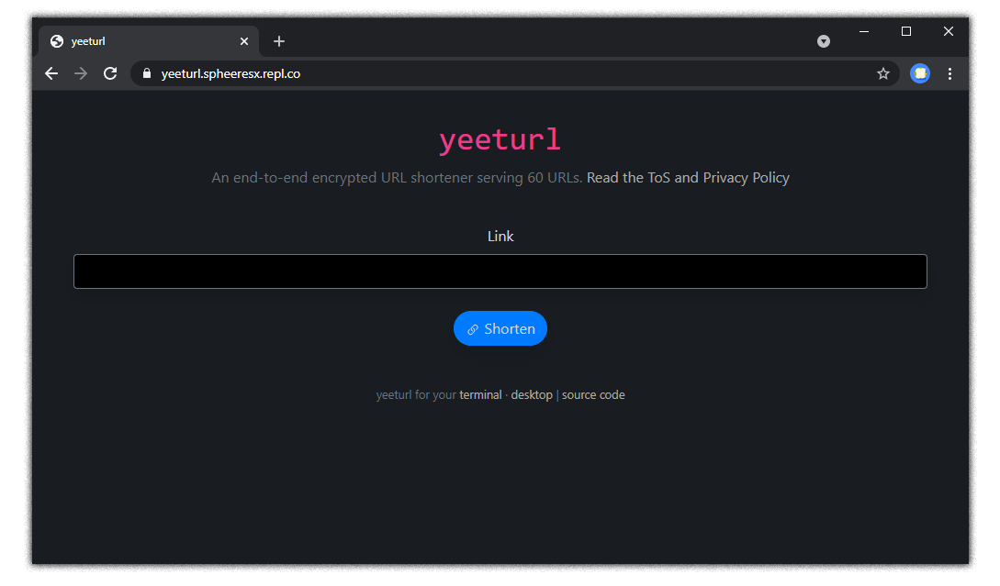

<h1 align="center">yeeturl</h1>

An end-to-end encrypted URL shortener.

## Features

- 🔐 **End-to-end encrypted.** Only you can read your links.
- ⚡ **Lightweight.** The website uses less than 15KB of data & the server doesn't perform any heavy tasks.
- 💨 **Easy to set up & manage.** Just get a MongoDB server, run the binary and you're ready to go.
- 💻 **[Desktop](https://github.com/SpheeresX/yeeturl-desktop-python) & [CLI](https://github.com/SpheeresX/yeeturl-desktop) apps that use less than 10MB of RAM.** Easily shorten URLs without worrying that the website has been backdoored.

## Installation

You need to have a MongoDB server for yeeturl to work. [Install](https://www.mongodb.com/try/download/community) it on your computer or get a server with [MongoDB Atlas](https://www.mongodb.com/try)

**Binaries for Linux, Windows & macOS (beta, no issues found yet)**

Download `yeeturl-server` from [here](https://github.com/SpheeresX/yeeturl-server/releases) and run it in the terminal.

Example: `./server-linux --port 1234 --mongodb "mongodb://127.0.0.1:27017/yeeturl" --privacy ./my_privacy_policy.txt`

**From source code**
1. Install Node.js
2. Clone this repository
3. Download all third-party libraries; open a terminal, `cd` into this repo, and type `npm i`.
4. Rename `env.example` to `.env` and modify the values in that file if needed
5. Write your own privacy policy and terms of service at `dist/privacy.txt`. If you are running yeeturl for yourself or just for a couple of friends, you can just remove everything from this file.
6. Run yeeturl with `node index.js` or `npm start`

*It is recommended that you run yeeturl behind a reverse proxy with a [modern HTTPS configuration](https://ssl-config.mozilla.org/).*

## Directory structure

- `/dist` - minified html/css/js files served by the server
- `/src` - unminified html/css/js files (run `gulp` to regenerate `/dist`)
- `/models` - mongoose models
- `/tools` - yeeturl tools (wip)
- `/routes` - express routes
- `/readme-images` - screenshots used in this file

FAQ

**How do I backup my instance?**

This is as simple as backing up your MongoDB database - an official guide is published [here](https://docs.mongodb.com/manual/core/backups/).
yeeturl doesn't save any files on your machine; you could even run it with no write access as long as the database does have it, making it easy to restore everything.
Usually, the restore process should be done by restoring your MongoDB database and following the installation steps above.

**Do I need to run `gulp` before running yeeturl?**

No - GitHub automatically takes care of that for us. You only need to run it if you've modified the front-end's source code (in `src/`).

**Can I use this in my own project?**

Yes! Please host your own instance if it's a large-scale project though.

API

- `/api/v1/shorten` - (POST) shorten a URL, the post body should be something like `{"link": "URL_ENCRYPTED_WITH_SJCL_HERE"}`
- `/api/v1/getlink?id=URL_ID_HERE` - (GET) get the encrypted data for a URL (you can decrypt that with sjcl)
- `/api/v1/count` - (GET) get the amount of shortened URLs

